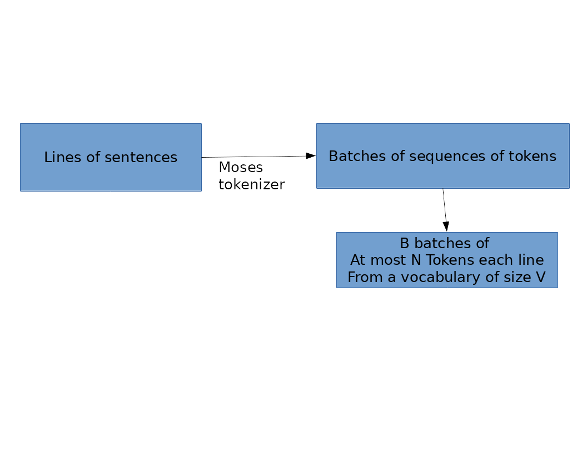
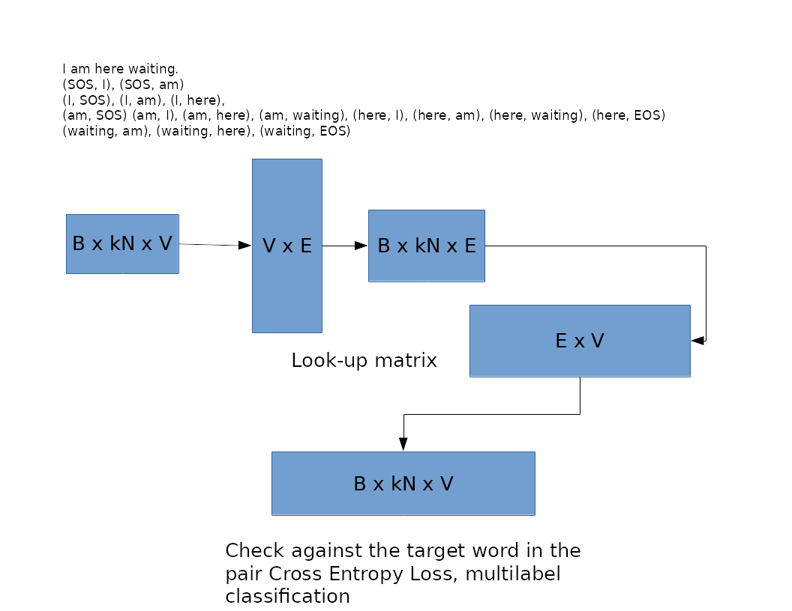
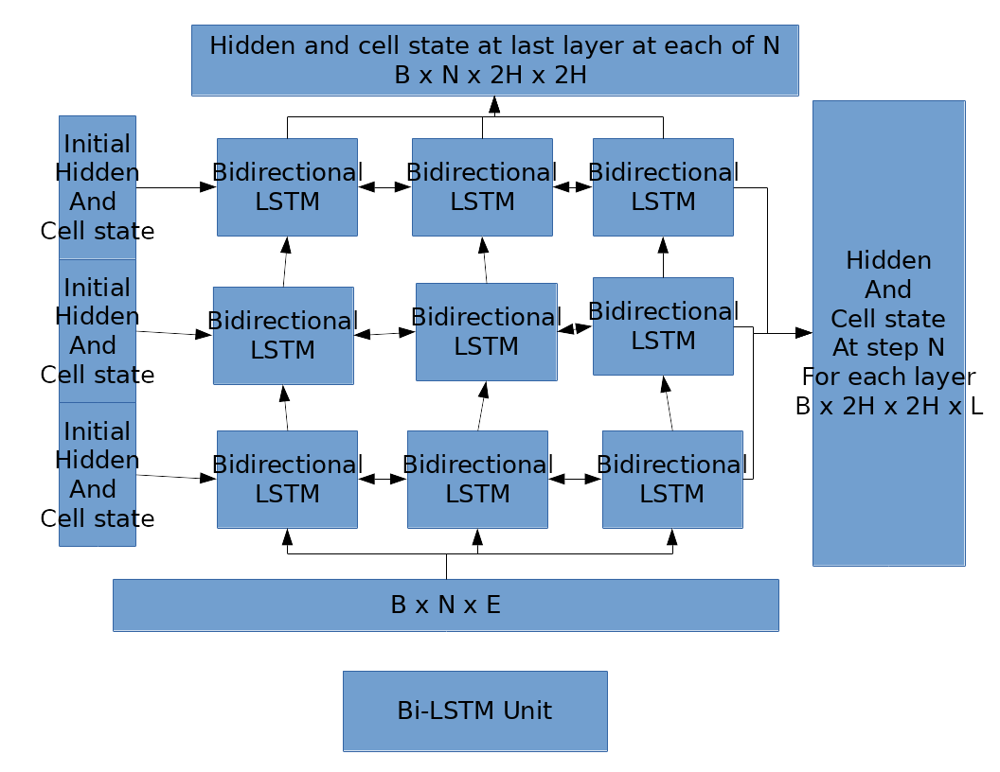
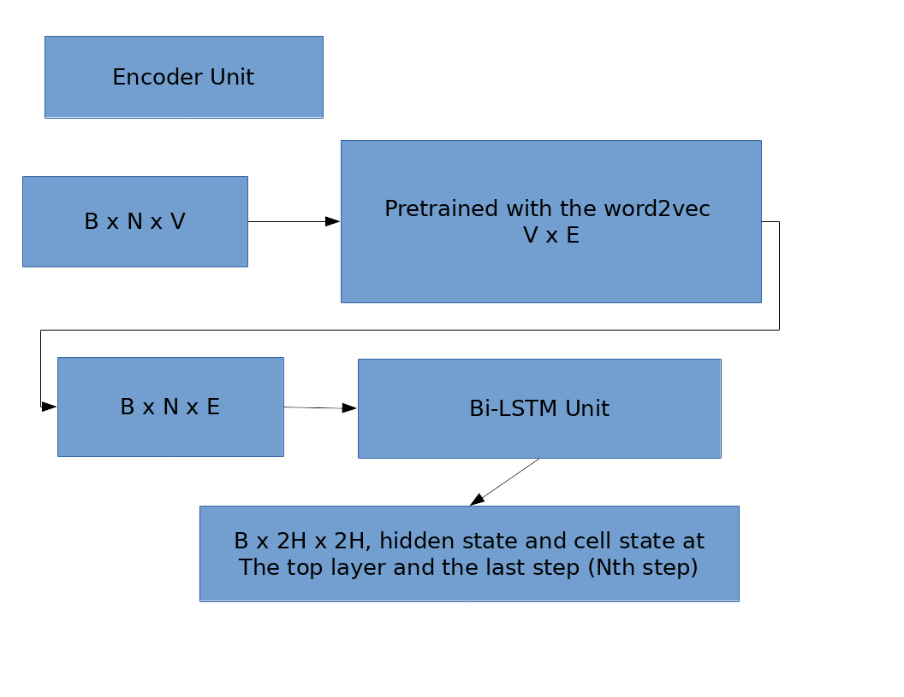
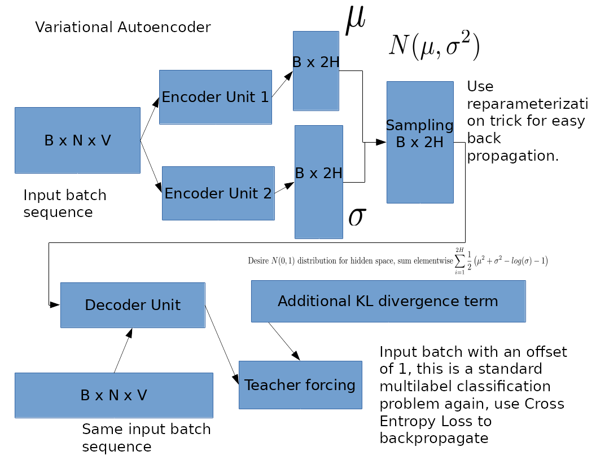
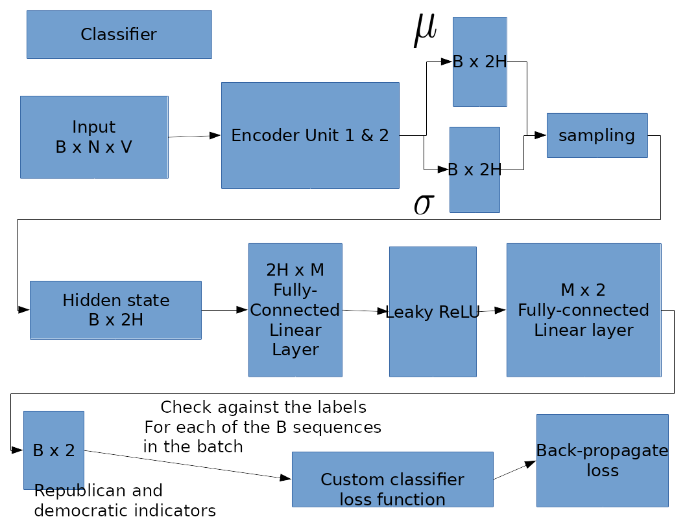
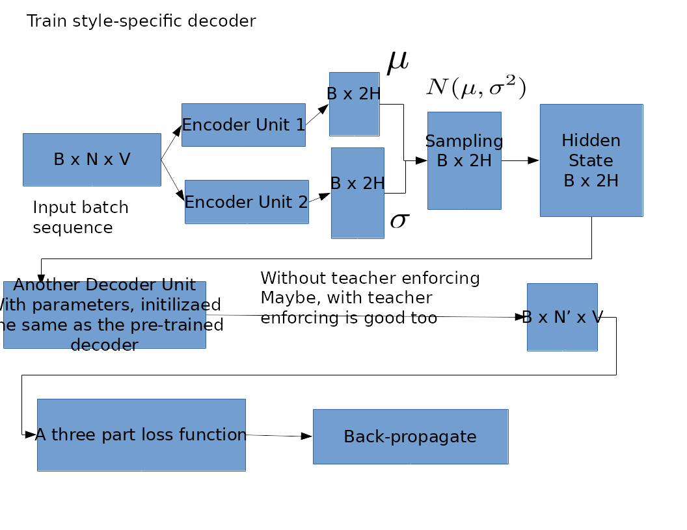
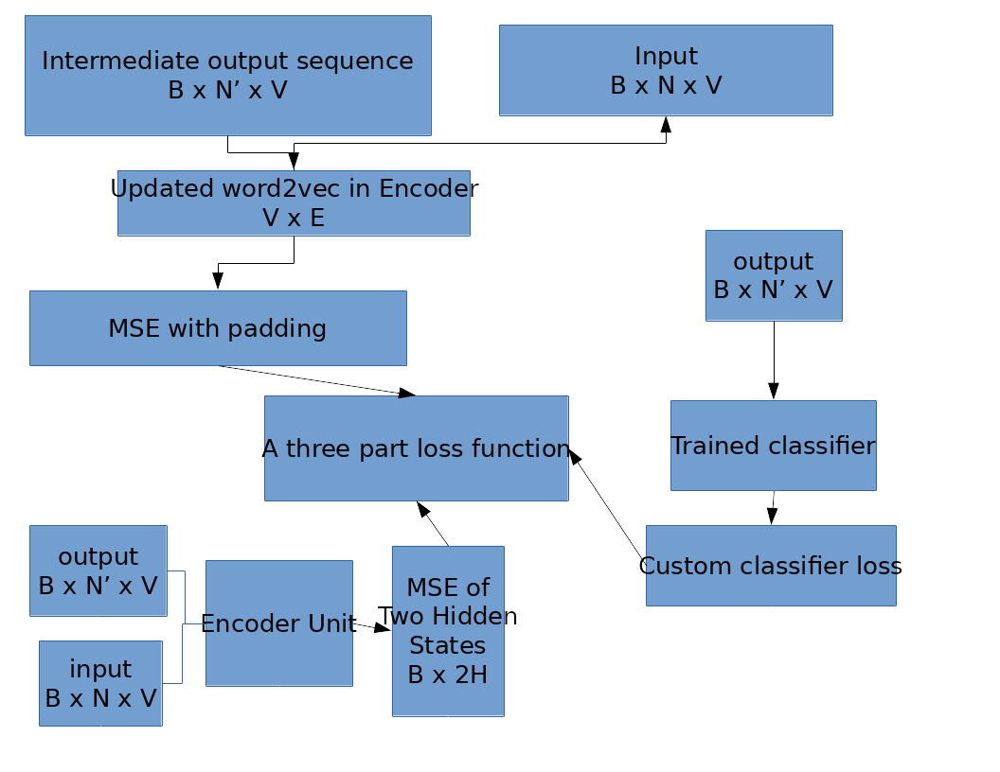

# pytorch_toy
Some Pytorch scripts that do MLR, word2vec, seq2seq etc. This is a playground for my Polarization Lab work.
Here is a schematic diagram of a proposed style transfer.

### Data Preparation 
Custom Pytorch DataSet and DataLoader that handles batching and pre-processing. This involves tokenizing the input with the Moses tokenizer, and indexing the input with integers.

### Word2Vec
This step takes an input of size B x kN x V, where B is the batch size, k is the context applied and V is the vocabulary size.
 As you can see, special SOS and EOS tokens are introduced to represent the start and end of a sequence. Strictly speaking, the number of pairs of tokens is not kN but kN minus away a few starting and ending tokens because these do not have full left and right neighbors. Also it is actually more appropriately 2kN, but let's just say it's O(kN).

### Bi-LSTM Unit
This is a standard bi-directional LSTM unit, that has L layers, hidden state and cell state of size H (in each direction). So the both directions concatenate to 2H.

Note the dimensions of the two outputs that Pytorch implements. We will make use of the output on the right (the vertical long bar) for Encoder Unit.

### Encoder Unit
Encoder just uses an embedding that is initialized with the parameters of the trained word2vec, feeds to the Bi-LSTM Unit and obtains a B x 2H hidden state at the end of the Nth step, that "encodes" the information of the whole batch of B x N x V tokens.

### Variational Autoencoder

This combines the common techniques used in VAE such as reparameterization, and the Teacher Forcing technique in seq2seq. These heuristics are necessary to construct the computational graph or speed up the training process. The KL divergence term is a closed form solution if we assume the entries in hidden vector space is normally distributed. Also different from a traditional VAE, we use a Bi-LSTM as encoder and another Bi-LSTM as decoder.

### Classifier
Classfier takes the encoder trained in the Variational Autoencoder as fixed. So we will probably use with torch.no_grad() etc. It gets the hidden state B x 2H, and applies a fully connected layer to the hidden state of dimension 2H x M. After that a Leaky ReLu to add non-linearity. Then another fully connected layer M x 2 to two nodes, which represent scores DEMOCRATIC and REPUBLICAN respectively.

An important feature is that we don't apply softmax, or sigmoid or any associated entropy loss to calculate loss, but we leave the scores as they are and apply a loss function as follows. Suppose for a pair of input, output in the batch, (x, y). y is given, which is DEMOCRATIC, represented by the FIRST_NODE in the two nodes in the final layer. If FIRST_NODE - SECOND_NODE > 0, then loss is zero because the classifier already concludes that the input is DEMOCRATIC. If TOP_NODE - SECOND_NODE < 0, then we apply a loss of SECOND_NODE - FIRST_NODE. This loss funciton resolves the problem of forcing an input sequence to be either 100% DEMOCRATIC or 100% REPUBLICAN.

### Style Decoder
Now we have trained the Encoder Unit and the Classifier. The parameters for these two objects should stay fixed from now on. For each style generation task, we then write another Decoder Unit that has the same dimension as the Decoder Unit in the Variational Autoencoder step. The parameters of this new Decoder Unit are initilized the same as the trained Decoder Unit too.

This decoder will generate an output sequence B x N' x V. Note the output sequence may have different lengths from input sequence, therefore we apply special padding characters to calculate loss. The special three-part loss function will be described below.

### Three-part Loss Function for Style Decoder

The three parts respectively correspond to:
* The similarity between input sequence and output sequence in terms of MSE embeddings
* The similarity between input sequence and output sequence in terms of MSE after passing each into the trained encoder to get their respective hidden states
* How far the output is from our desired political style according to the Classifier. After these, we back-propagate the three-part loss.

### Wrap-Up
Pytorch other common practices, such as Dropout and easy implementation of optimizer. Adam is a nice choice.
